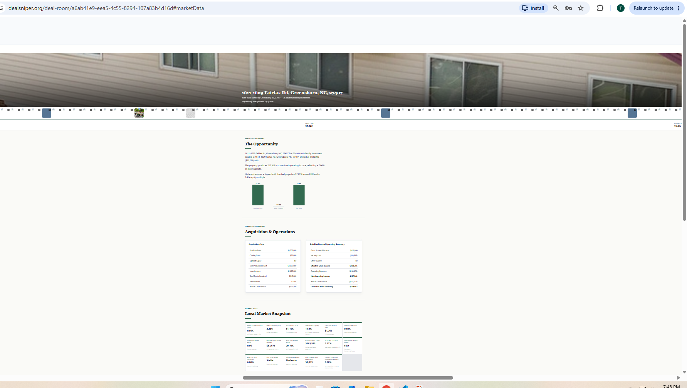

# CRE Underwriting Spreadsheet Platform

A Google Sheets–style spreadsheet, in one dependency-free JavaScript file, preloaded
with a complete commercial real estate underwriting model (multifamily, retail,
industrial, office, self-storage, mixed-use) built entirely from live cell formulas.

## Files

    cre-underwriting/
      cre-underwriting.js    the entire platform (engine + UI, self-contained)
      index.html             working example page — open it or copy the pattern
      tests/
        engine.test.js       underwriting math regression suite (Node)
        features.test.js     functions / ref-rewriting / structure suite (Node)
      README.md

## Add to your website

1. Copy `cre-underwriting.js` anywhere in your site (e.g. `/js/`).
2. Where you want the spreadsheet, add:

    

    
    

3. Give the mount div a height (e.g. `height: 100vh` or a fixed px height).
   The component fills its container.

That's it. No build step, no npm, no framework required. Works alongside any
stack (plain HTML, WordPress, React, etc. — for React, call `init()` in a
`useEffect` after the div mounts).

## init options

    CREUnderwriting.init({
      mountId: "cre-underwriting",              // id of the mount div
      exportFileName: "CRE_Underwriting_Model.xlsx",
      sheetJsUrl: "https://cdnjs.cloudflare.com/ajax/libs/xlsx/0.18.5/xlsx.full.min.js"
    });

`sheetJsUrl`: the .xlsx upload/download feature lazy-loads SheetJS from this URL.
If your site's Content-Security-Policy blocks cdnjs, download that file, host it
yourself, and point `sheetJsUrl` at your copy. Everything else runs with zero
network access.

## What's inside

- Sheets-style UI: grid, formula bar, A1 refs, sheet tabs, range selection,
  fill handle, copy/paste with relative-reference adjustment, undo/redo (100
  levels), right-click insert/delete rows & columns (all formulas rewrite
  automatically), add/rename/delete sheets, column resize, formatting toolbar
  (bold, $, %, decimals, text/fill color), gridlines on/off, zoom 50–200%.
- Model tabs: Inputs, Pro Forma (10-yr + forward year), Debt (sizing by lesser
  of LTV / DSCR / debt yield, IO + amortization), Summary (cap rate, GRM,
  price/unit, price/SF, DSCR, debt yield, LTV, CoC, break-even occupancy,
  exit), Cash Flows (levered/unlevered IRR, equity multiple), Waterfall
  (compounding pref -> return of capital -> promote), Sensitivity (exit cap x
  rent growth IRR grid).
- Formula engine: SUM, MIN, MAX, AVERAGE, COUNT, COUNTA, IF, AND, OR, NOT,
  IFERROR, INDEX (1-D and 2-D), MATCH, VLOOKUP, HLOOKUP, SUMIF, SUMIFS,
  COUNTIF, AVERAGEIF, SUMPRODUCT, NPV, IRR, XNPV, XIRR, PMT, PV, FV, DATE,
  TODAY, ROUND, ROUNDUP, ROUNDDOWN, INT, CEILING, FLOOR, ABS, POWER, SQRT,
  MOD, MEDIAN, STDEV, LARGE, SMALL, RANK, CONCATENATE, LEFT, RIGHT, MID, LEN,
  UPPER, LOWER, TRIM, ISNUMBER, ISBLANK, ISERROR. Cross-sheet refs
  ('Pro Forma'!B23), absolute refs ($B$9), ranges, error propagation
  (#REF!, #DIV/0!, #NAME?, #N/A, #CYCLE!).
- Upload any .xlsx (Excel or Google Sheets export): opens as tabs, formulas
  evaluated live where supported, saved values as fallback otherwise.
- Download .xlsx with live formulas: opens in Excel; import to Google Sheets
  via File -> Import. Sensitivity tab exports computed values (its scenario
  function has no Excel equivalent).

## Run the tests

    node tests/engine.test.js
    node tests/features.test.js

Both should print ALL TESTS PASSED / FEATURE TESTS PASSED.

## Notes

- Browser support: evergreen browsers (uses regex lookbehind and CSS zoom with
  a transform fallback). No IE11.
- Educational/analytical tool — not investment, legal, tax, or lending advice.
